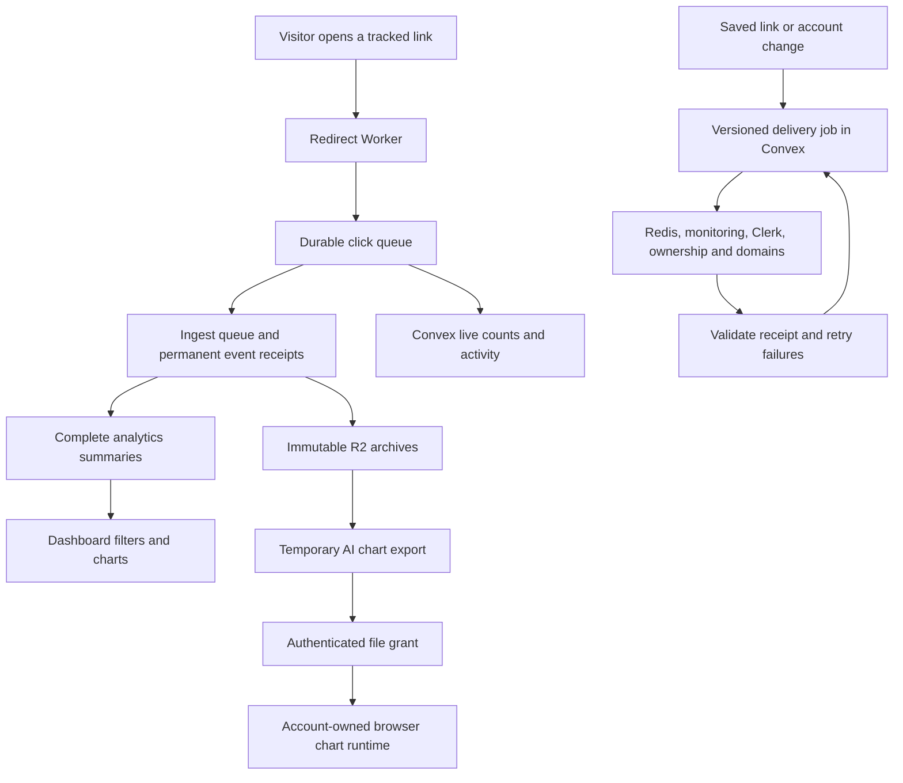

# Architecture changes and verification

Implemented locally on September 5, 2026, across the frontend, redirect Worker,
file proxy, ingest service and monitoring service. Three agents handled separate
service areas; the main task integrated and reviewed their shared contracts.
No production deployment, queue provisioning or historical data rebuild was run.

## What changed and why

| Area | Change | Benefit |
| --- | --- | --- |
| Correct analytics totals | Permanent event receipts, transactional counts, immutable archives and a separate-file rebuild | Retried, late and archived clicks do not inflate or overwrite totals. |
| Reliable click delivery | A durable edge queue, stable event IDs and validated downstream receipts | Temporary service failures can retry the same click safely. |
| Reliable service updates | Saved, versioned jobs for redirects, monitoring, Clerk, ownership and domains | A failed external request does not leave a saved link or account permanently out of sync. Old retries cannot undo newer changes. |
| Consistent analytics | Complete server summaries, shared filters, coverage and freshness information | Recent and archived date ranges use the same counting rules. AI charts request complete, temporary exports. |
| Guest and account privacy | Signed guest credentials, owner aliases, exact file grants, private responses and account-scoped browser state | Claimed guest history remains accessible to its owner; another account cannot reuse its file access or cached data. |
| Honest link health | Durable measurements, duplicate protection, ordered status updates and explicit unknown/stale states | Delayed checks do not replace newer results; blocked or missing checks do not imply healthy uptime. |
| Recovery and operations | Backups through the database owner, checksum-verified restore, replay tools, readiness checks and CI | Recovery has executable steps and verification instead of relying on an untested database copy. |
| Bounded application work | Paginated lists, indexed collection membership, maintained counters and lazy chart data loading | Large accounts avoid loading or rewriting their entire history for routine reads and writes. |

## Main data paths

The redirect waits for queue acceptance. The consumer completes delivery only
after ingest and the live view confirm the expected event. Ingest's HTTP receipt
means that Redis accepted the job; its consumer keeps the job unfinished until
the database transaction commits. Redis persistence remains a deployment duty.

## Verification performed

| Repository | Automated tests | Other checks |
| --- | ---: | --- |
| Frontend and Convex | 74 | Full TypeScript check, lint, Next.js build and OpenNext Cloudflare bundle |
| Redirect Worker | 32 | TypeScript, Biome, generated binding check, production and development deployment dry-runs |
| File proxy | 39 | TypeScript, generated binding check, production and development deployment dry-runs |
| Ingest service | 26 | TypeScript and separate DuckDB refactor checks |
| Monitoring service | 16 | TypeScript, fresh PostgreSQL migration and real local PostgreSQL/Redis integration |
| **Total** | **187** | No remote deployment was part of these checks. |

Tests exercise duplicate delivery, late events, archive/rebuild count parity,
failed acknowledgements, reordered updates, deletion races, guest ownership,
filters, collection migration, file expiry, byte ranges and access revocation.
The proxy tests use workerd storage and include actual Clerk JWT signature
verification: a forged token returns 401 without requesting account data.

A separate local Convex backend accepted the final schema and functions. Its
integration check created an authenticated test account and link, delivered the
same click twice, verified a count of one, listed the link, deleted it, and
verified that a retry could not restore the deleted link or its count.

In the actual local browser, a signed-out visitor created a link and saw its new
row on the page. This used the isolated Convex backend and a local rate-limit
fixture. Authenticated analytics, AI charts and account switching were covered
by code review and automated checks; their full browser journeys still need
staging verification with real staging accounts and service credentials.

A local synthetic ingest check summarized 100,000 archived clicks into 1,200
summary rows. A dashboard query took about 7 ms and read no Parquet files.
This establishes the query path, not a production latency guarantee.

Frontend lint completes with 25 existing warnings, mainly accessibility and
hook warnings. Added warnings were resolved. Build tools still warn about the
existing Next.js middleware convention and Cloudflare compatibility date.
Authored changes pass whitespace checks; generated Worker declarations are
validated by their generator. The tracked ingest data fixture was not changed.

## Behavior changes and limits

- A tracked redirect returns a retryable 503 if its event cannot enter the durable
  queue. This favors retaining clicks, with an availability cost during a queue
  outage. Tracking-disabled links skip event collection.
- Lists load bounded pages. Search and sorting apply to loaded rows, as stated
  beside the controls; users can load more rows. This changes the previous
  full-list search behavior and should be included in release review.
- Account and collection totals show an unavailable/updating state until their
  migration completes. Link health distinguishes unknown and overdue results.
- The live activity feed retains 30 days. Click and health receipts retain 35
  days; older replay updates durable analytics without rewriting live history.
- Explicit chart exports expire after one hour by default. The chart client
  refreshes expired exports and reports failures rather than displaying false
  empty results. Export and read limits return retryable errors at capacity.
- Previously downloaded files cannot be revoked. New client requests use a new
  cache version and require current access checks, including internal cache hits.
- Permanent analytics receipts and summary tables grow with event and dimension
  counts. Their storage and backup time need monitoring under real traffic.

## Release and migration

Use the coordinated cutover in the
[ingest recovery guide](/Users/sunny/Desktop/Projects/ndle-workspace/ndle-ingest-service/docs/RECOVERY.md).
Do not stop the old ingest process while the old redirect still sends clicks
without durable buffering. Establish durable capture with delivery paused before
the database handover. Analytics may lag while the queue is paused; this is not
a claim of a zero-downtime migration.

Before release, configure and verify:

- Separate development and production queues, failed-message queues, retention
  and alarms. The documented 14-day retention requires the appropriate paid
  Cloudflare Queues plan. Development ingest and file-grant endpoints are
  intentionally blank until staging endpoints are supplied.
- Durable Redis storage, persistent DuckDB storage, R2 credentials and matching
  `API_SECRET`, `SHARED_SECRET`, `FILE_ACCESS_SECRET` and monitoring secrets.
- Convex's Redis, Clerk, ingest, monitoring and Cloudflare credentials. Set the
  same dedicated `GUEST_SESSION_SECRET` in Next.js and Convex.
- The proxy's matching Clerk issuer and `CONVEX_URL`; file callers use the Clerk
  `convex` token template. Account lookup can work while metadata delivery retries.

Deploy the additive Convex schema and functions before the new monitoring
service and frontend. One-minute crons migrate account contributions, owner
aliases and collections in bounded batches. Existing domain adoption runs daily;
`internal.domainSync.bootstrapDomains({ cursor: null })` can start it during the
controlled rollout. Verify pending delivery jobs reach completion before calling
the account or domain migration finished. Source guest history is not rewritten.

Rebuild analytics to a new database path using the complete legacy archive index
and retained source records. Investigate count differences before approving an
explicit expected event count. Keep the source database and old images. Import
owner aliases and the archive manifest before enabling the strict file proxy.
Apply monitoring migration `0004_reliable_monitoring.sql` before its new service
starts. Release the frontend after its backend contracts are available.

Before production acceptance, verify queue drain, duplicate replay, recent and
archived filters, guest claim and archive access, denied cross-account access,
sign-out/account switching, expired chart refresh, link deletion, monitoring
readiness and a backup restored to an isolated location. Record the deployed
versions and reviewed migration report.

For rollback, pause queue delivery and preserve all queued events, receipts,
manifests and new database files. Do not point the old ingest code at the new
database or restore the old monitoring scheduler with unfinished durable checks.
Do not restore the old lossy redirect path while writes are stopped. Any rollback
must reconcile events accepted since cutover, following the recovery guide.

Related service instructions:

- [Redirect queue setup and replay](/Users/sunny/Desktop/Projects/ndle-workspace/ndle-worker/README.md)
- [File proxy access and settings](/Users/sunny/Desktop/Projects/ndle-workspace/ndle-cloudflare-fileproxy/README.md)
- [Monitoring migration and readiness](/Users/sunny/Desktop/Projects/ndle-workspace/ndle-link-monitoring/README.md)
- [Collection migration and list behavior](/Users/sunny/Desktop/Projects/ndle-workspace/ndle-frontend/docs/collection-scaling.md)

The checks provide evidence against specific regressions. They do not prove that
no regression is possible, and they do not replace the staging and production
verification above. Unrelated frontend skill changes and `app/landing-v2/` work
were preserved. Implementation verification did not deploy to a shared
environment. The five changesets are published separately from the live release
branches so the coordinated cutover can be completed before release.
