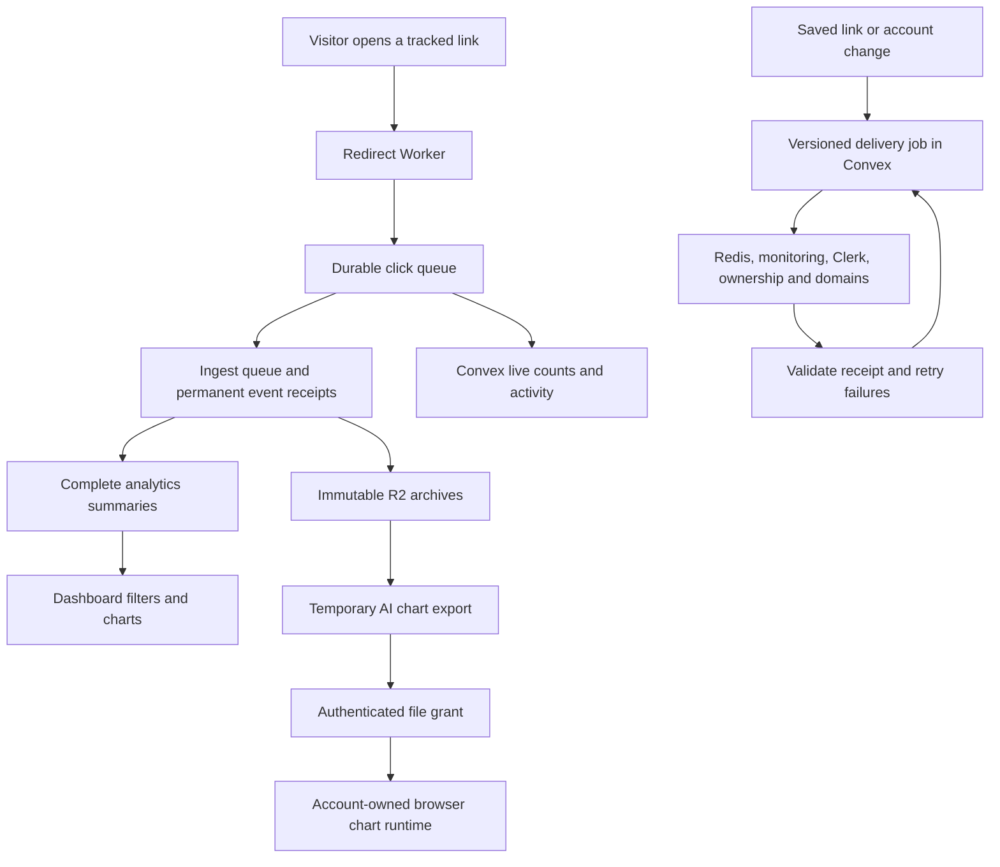

# Architecture changes and verification

Implemented and deployed on September 5, 2026, across Convex, the frontend,
redirect Worker, file proxy, ingest service and monitoring service. Three agents
handled separate service areas; the main task integrated and reviewed their
shared contracts. The original checks below are followed by the production
release evidence and remaining verification limits.

## What changed and why

| Area | Change | Benefit |
| --- | --- | --- |
| Correct analytics totals | Permanent event receipts, transactional counts, immutable archives and a separate-file rebuild | Retried, late and archived clicks do not inflate or overwrite totals. |
| Reliable click delivery | A durable edge queue, stable event IDs and validated downstream receipts | Temporary service failures can retry the same click safely. |
| Reliable service updates | Saved, versioned jobs for redirects, monitoring, Clerk, ownership and domains | A failed external request does not leave a saved link or account permanently out of sync. Old retries cannot undo newer changes. |
| Consistent analytics | Complete server summaries, shared filters, coverage and freshness information | Recent and archived date ranges use the same counting rules. AI charts request complete, temporary exports. |
| Guest and account privacy | Signed guest credentials, owner aliases, exact file grants, private responses and account-scoped browser state | Claimed guest history remains accessible to its owner; another account cannot reuse its file access or cached data. |
| Honest link health | Durable measurements, duplicate protection, ordered status updates and explicit unknown/stale states | Delayed checks do not replace newer results; blocked or missing checks do not imply healthy uptime. |
| Recovery and operations | Backups through the database owner, checksum-verified restore, replay tools, readiness checks, email alerts and CI | Recovery has executable steps and verification. Scheduled checks notify the owner about delayed clicks, failed deliveries, unavailable services and old backups. |
| Bounded application work | Paginated lists, indexed collection membership, maintained counters and lazy chart data loading | Large accounts avoid loading or rewriting their entire history for routine reads and writes. |

## Main data paths

The redirect waits for queue acceptance. The consumer completes delivery only
after ingest and the live view confirm the expected event. Ingest's HTTP receipt
means that Redis accepted the job; its consumer keeps the job unfinished until
the database transaction commits. Redis persistence remains a deployment duty.

## Verification performed

| Repository | Automated tests | Other checks |
| --- | ---: | --- |
| Frontend and Convex | 74 | Full TypeScript check, lint, Next.js build and OpenNext Cloudflare bundle |
| Redirect Worker | 32 | TypeScript, Biome, generated binding check, production and development deployment dry-runs |
| File proxy | 39 | TypeScript, generated binding check, production and development deployment dry-runs |
| Ingest service | 26 | TypeScript and separate DuckDB refactor checks |
| Monitoring service | 16 | TypeScript, fresh PostgreSQL migration and real local PostgreSQL/Redis integration |
| **Total** | **187** | These were the initial implementation checks; production checks are recorded below. |

Tests exercise duplicate delivery, late events, archive/rebuild count parity,
failed acknowledgements, reordered updates, deletion races, guest ownership,
filters, collection migration, file expiry, byte ranges and access revocation.
The proxy tests use workerd storage and include actual Clerk JWT signature
verification: a forged token returns 401 without requesting account data.

A separate local Convex backend accepted the final schema and functions. Its
integration check created an authenticated test account and link, delivered the
same click twice, verified a count of one, listed the link, deleted it, and
verified that a retry could not restore the deleted link or its count.

In the actual local browser, a signed-out visitor created a link and saw its new
row on the page. This used the isolated Convex backend and a local rate-limit
fixture. At that stage, authenticated analytics, AI charts and account switching
had code review and automated coverage. Signed-in production analytics was later
verified below. AI charts and account switching still need full browser checks
with suitable accounts and service credentials.

A local synthetic ingest check summarized 100,000 archived clicks into 1,200
summary rows. A dashboard query took about 7 ms and read no Parquet files.
This establishes the query path, not a production latency guarantee.

Frontend lint completes with 25 existing warnings, mainly accessibility and
hook warnings. Added warnings were resolved. Build tools still warn about the
existing Next.js middleware convention and Cloudflare compatibility date.
Authored changes pass whitespace checks; generated Worker declarations are
validated by their generator. The tracked ingest data fixture was not changed.

## Behavior changes and limits

- A tracked redirect returns a retryable 503 if its event cannot enter the durable
  queue. This favors retaining clicks, with an availability cost during a queue
  outage. Tracking-disabled links skip event collection.
- Lists load bounded pages. Search and sorting apply to loaded rows, as stated
  beside the controls; users can load more rows. This changes the previous
  full-list search behavior and should be included in release review.
- Account and collection totals show an unavailable/updating state until their
  migration completes. Link health distinguishes unknown and overdue results.
- The live activity feed retains 30 days. Click and health receipts retain 35
  days; older replay updates durable analytics without rewriting live history.
- Explicit chart exports expire after one hour by default. The chart client
  refreshes expired exports and reports failures rather than displaying false
  empty results. Export and read limits return retryable errors at capacity.
- Previously downloaded files cannot be revoked. New client requests use a new
  cache version and require current access checks, including internal cache hits.
- Permanent analytics receipts and summary tables grow with event and dimension
  counts. Their storage and backup time need monitoring under real traffic.

## Release and migration

Use the coordinated cutover in the
[ingest recovery guide](/Users/sunny/Desktop/Projects/ndle-workspace/ndle-ingest-service/docs/RECOVERY.md).
Do not stop the old ingest process while the old redirect still sends clicks
without durable buffering. Establish durable capture with delivery paused before
the database handover. Analytics may lag while the queue is paused; this is not
a claim of a zero-downtime migration.

Configuration required for each environment:

- Separate development and production queues, failed-message queues, retention
  and alarms. The documented 14-day retention requires the appropriate paid
  Cloudflare Queues plan. Development ingest and file-grant endpoints are
  intentionally blank until staging endpoints are supplied.
- Durable Redis storage, persistent DuckDB storage, R2 credentials and matching
  `API_SECRET`, `SHARED_SECRET`, `FILE_ACCESS_SECRET` and monitoring secrets.
- Convex's Redis, Clerk, ingest, monitoring and Cloudflare credentials. New
  environments should use the same dedicated `GUEST_SESSION_SECRET` in Next.js
  and Convex. Production currently uses the existing `API_SECRET` fallback;
  changing that signing key requires a separate guest-session transition.
- The proxy's matching Clerk issuer and `CONVEX_URL`; file callers use the Clerk
  `convex` token template. Account lookup can work while metadata delivery retries.

Deploy the additive Convex schema and functions before the new monitoring
service and frontend. One-minute crons migrate account contributions, owner
aliases and collections in bounded batches. Existing domain adoption runs daily;
`internal.domainSync.bootstrapDomains({ cursor: null })` can start it during the
controlled rollout. Verify pending delivery jobs reach completion before calling
the account or domain migration finished. Source guest history is not rewritten.

Rebuild analytics to a new database path using the complete legacy archive index
and retained source records. Investigate count differences before approving an
explicit expected event count. Keep the source database and old images. Import
owner aliases and the archive manifest before enabling the strict file proxy.
Apply monitoring migration `0004_reliable_monitoring.sql` before its new service
starts. Release the frontend after its backend contracts are available.

Before production acceptance, verify queue drain, duplicate replay, recent and
archived filters, guest claim and archive access, denied cross-account access,
sign-out/account switching, expired chart refresh, link deletion, monitoring
readiness and a backup restored to an isolated location. Record the deployed
versions and reviewed migration report.

For rollback, pause queue delivery and preserve all queued events, receipts,
manifests and new database files. Do not point the old ingest code at the new
database or restore the old monitoring scheduler with unfinished durable checks.
Do not restore the old lossy redirect path while writes are stopped. Any rollback
must reconcile events accepted since cutover, following the recovery guide.

Related service instructions:

- [Redirect queue setup and replay](/Users/sunny/Desktop/Projects/ndle-workspace/ndle-worker/README.md)
- [File proxy access and settings](/Users/sunny/Desktop/Projects/ndle-workspace/ndle-cloudflare-fileproxy/README.md)
- [Monitoring migration and readiness](/Users/sunny/Desktop/Projects/ndle-workspace/ndle-link-monitoring/README.md)
- [Collection migration and list behavior](/Users/sunny/Desktop/Projects/ndle-workspace/ndle-frontend/docs/collection-scaling.md)

The checks provide evidence against specific regressions. They do not prove that
no regression is possible. Unrelated frontend skill changes and `app/landing-v2/`
work were preserved. All five service changesets were merged and pushed to their
own `master` branches before the coordinated production rollout.

## Production release evidence — September 5, 2026

Convex production `cheery-starling-175` deployed from frontend commit `d6da57f`.
Schema validation and bounded reads through all 14 new indexes passed. The
deployment exposes 80 functions. Compatibility backfills have no remaining URL,
user, guest-session or collection rows. All 38 service sync jobs completed,
including the five existing ownership jobs and their ten account aliases.
Later frontend changes from another active task were preserved; they did not
change the deployed Convex source.

The durable redirect path first deployed as version
`fba610c5-e270-486b-bce5-f88d9cfb9649`, from commit `27368f9`, on both production
routes. The final operations deployment is recorded below. The main and failed
queues each have 14-day retention. The main consumer
uses batches of ten, a one-second wait and 12 retries before the failed queue.
Delivery was paused and its saved state was checked before stopping old ingest.
An isolated real redirect returned 302 and its exact event remained in the queue
without delivery attempts during the database handover.

After backend readiness, ownership and restore checks passed, delivery was
resumed and the saved pause setting was verified as false. Event
`9915dac5-7781-4854-b856-71f844b03940` reached ingest and Convex once. Replaying
its unchanged saved envelope returned the duplicate outcome and kept one
ingest receipt, one raw event and one Convex receipt, with unchanged live
counts. The ingest queue had zero waiting, active and failed jobs after replay.

The original ingest process drained and stopped cleanly at 17:09:12 UTC. Its
checkpointed database, checksum, PostgreSQL data, archive index, application
configuration and old image are retained on the server. The old source database
was not modified by rebuilding. Production ingest commit `ec7486c` completed
deployment as the sole database owner and passed `/health/ready` by 17:57:07 UTC.

The archive inventory contains 88 files: 82 from the old index and six recovered
from the bucket inventory. Legacy archives without an owner column required a
focused compatibility fix. The loader takes that owner only from a verified
manifest and rejects conflicting row, path or manifest ownership. Nineteen
lifecycle tests, TypeScript, independent review and CI passed for that fix.

Historical reconciliation examined 398,832 distinct raw objects. Of those,
398,605 matched both the isolated stress-test owner and the test event-ID format;
these raw test objects remain untouched. Every one of the other 227 raw bodies
was checked. Thirty-two events absent from the retained archives and hot records
were recovered. Matching event IDs had consistent owners and links; observed
timestamp differences came from archive truncation to whole seconds.

The accepted rebuilt database contains 2,230 unique receipts and 2,230 counted
events: 624 account/guest events, 1,605 existing stress-test events and one
separately owned legacy test event. Its 88 archive files are indexed. The old
aggregate total was 8,753: 3,210 for the stress-test owner and 5,543 for the other
owners. The available event records do **not** explain the full difference
between 5,543 and 624. This release does not claim lossless reconstruction or
that the whole difference was duplicate inflation. Original totals and all
retained source material remain available for investigation.

Live summary checks returned 497 events for the largest preserved historical
owner across its full history and 137 for an archived day. Ordinary summary requests took about
100–142 ms and read no Parquet files in these small samples. A complete export
returned all 497 events in one Parquet file with complete coverage; its cold
request took 15.5 seconds. These observations are not a traffic benchmark.
Seven live filters matched independent counts from that export: country 255,
device 490, browser 117, operating system 220, link 41, excluding bots 486, and
combined filters 35. All five current synchronized accounts matched the
restored database. Historical owners no longer present in those five accounts
remain preserved without invented ownership aliases.

An immediate backup through the running database owner completed and its R2
content matched the recorded SHA-256. An isolated restore of that exact backup
passed schema readiness, all 2,230 pre-fixture event counts and all ten owner
alias pairs. A later restore confirmed 2,231 events after the first test click,
with that count unchanged after its duplicate replay.
After five additional isolated test redirects, the final owner-created backup
restored with 2,236 receipts, 2,236 daily clicks and 2,236 dimension clicks:
the accepted 2,230 baseline plus six distinct test events. Each test ID had one
ingest raw row, one ingest receipt and one Convex live receipt. Their six
R2 recovery objects matched the expected IDs and owners. The final backup's
SHA-256 is
`df900c2a2336ccf53e643f5f9d20d9cb8f1010082beefd740097fda20f711a0e`.
Waiting, active and failed ingest jobs and the memory buffer were all zero.

The stricter production file proxy, commit `8e04aee`, deployed as version
`b900df23-eab1-4597-acf5-e798525e4fad`. API readback confirmed its production
bucket, Convex URL, allowed origins and file-grant endpoint. Existing Clerk
secrets were preserved; a dedicated matching file-access secret was installed in
both services. Live internal checks allowed the indexed owner and complete
export owner, denied another existing account and raw source keys, and returned
401 for the wrong service secret. Public missing/forged-token requests returned
401 with private, non-stored responses. Allowed-origin preflight returned 204;
an unapproved origin returned 403.

Monitoring commit `3412b42` is live after migration `0004`. Scheduled and manual
checks reached Convex. Replaying one saved measurement twice retained one
receipt and unchanged daily counts. Repeated registration did not move the
next scheduled check. After a controlled Redis restart, monitoring passed
internal and public readiness checks. Redis now persists `appendonly yes`,
`appendfsync always` and `maxmemory-policy noeviction` in its saved configuration;
the effective values were verified after restart. Existing Redis volume data
and the final stopped-writer monitoring database dump are preserved.

Monitoring retains 5,000 old failed jobs. A bounded sample predates this rollout;
none had a current check ID. There were zero new failed jobs after this rollout's
monitoring start. Old failures were neither bulk-retried nor deleted.

Signed-in browser testing found a frontend mismatch: the summary groups some
link counts by full short URL, while the list expected a bare slug. Frontend
commit `cf27445` normalizes both formats, combines equivalent counts before
ranking and uses the current link record for its destination and detail route.
Three focused tests, TypeScript, lint, independent review and CI passed. Stored
event records were not changed by this display fix.
The deployed browser now shows the correct short link and destination, with a
valid `/link/<slug>` detail route. The signed-in account's all-time total was
114 with complete coverage; 30 days showed one click and 24 hours showed a
truthful empty state. The five extra test redirects all returned 302 to their
exact test destination with browser caching disabled. Their client request
times ranged from 541 to 1,681 ms; this small sample is not a latency percentile
or a before/after benchmark.

Link-detail testing also found response field names that did not match the
charts. Frontend commit `d926965` adds validated response aliases for daily
times, country/browser/device/OS labels and referrer names while preserving the
original fields. Nineteen focused tests, TypeScript, lint and CI passed.
The deployed signed-in detail view showed the expected one click, India, Brave,
desktop and `ndle.app` referrer; its daily chart drew the real one-click point.
The human/bot chart uses the link-filtered backend counts and showed one human
and zero bots. The backend supplies daily data, so the hourly view explicitly
reports that hourly data is unavailable. It does not place daily counts at
midnight or assume all traffic is human. The seven-day empty state also passed.
This browser verification used frontend version
`e11de74a-a262-42d2-8873-f0ee32b9d628`; API readback confirmed 100% traffic.

### Operational email alerts

Worker commit `6906b25` deployed as version
`4b36c1fd-d851-4b90-9ca5-39658d89df72` at 18:58:00 UTC. API readback confirmed
100% traffic, both queue bindings, the `ndle-analytics` backup bucket, the enabled
five-minute schedule and the three email secrets. The main queue remained
unpaused; both queue backlogs were zero. Ingest readiness, monitoring readiness,
proxy health and the frontend returned 200; the deleted test link returned 404.
The complete Worker suite passed 41 tests with 96 assertions, TypeScript,
Biome, generated binding checks, both environment dry-runs and CI. Independent
review also checked readiness failures and bounded timeouts.

The first operations deployment exposed a Worker runtime difference:
`redirect: "error"` is not supported. Its first scheduled run failed before any
email request could leave the Worker. The final version uses `manual` and checks
response status, preventing health and email requests from following redirects
with service credentials. The regression test covers rejected health and email
redirects. The redirect and click-delivery handlers did not change in this fix.
The corrected production schedule ran at 19:00:56 UTC on the final version:
`outcome: ok`, no exceptions and `issues: []`. It completed in 1,004 ms with
3 ms of CPU time and sent no email for that healthy result. This exercised
the real queue metrics, backup binding, ingest checks and monitoring request.

Alerts go to `sunny735084@gmail.com` from
`NDLE alerts <notifications@alerts.ndle.app>`. The dedicated sending subdomain
and its three DNS records are verified. The new Resend key can only send mail
for that domain; a management request with it was denied. A labeled test email
was accepted at 18:38:52 UTC and the provider confirmed delivery, message ID
`3cc04170-5022-4d0b-b06e-82fa0b4492b8`. This confirms provider delivery, not that
the recipient opened it. Existing Coolify mail settings were preserved.

Scheduled checks cover clicks older than five minutes when queue age is
available, large queues, failed click deliveries, ingest failures, monitoring
readiness and backup manifests older than 26 hours or missing their file.
Healthy checks send no email. An unchanged set of problems sends at most one
reminder per hour; changed problems may send a new alert. No production failure
was created just to trigger an email. The backup check validates manifest fields
and file size; the separate restore exercise above verifies the actual checksum
and database contents.

The temporary Coolify rollout token was revoked after final restoration passed.
A subsequent request returned 401. Its local credential file and the temporary
file used to transfer the dedicated file-access secret were removed. Persistent
production secrets and the user's Cloudflare authorization remain. Temporary
alert-key transfer files were also removed after the installed secrets were
verified; the restricted production sender key remains active.

### Verification limits

- Production disables the AI chart/export interface. Positive authenticated
  Parquet byte-range requests could not be exercised through that interface.
  The live internal grant checks and 39 proxy runtime/auth/range tests passed;
  they do not establish a complete production browser download journey.
- Production had no claimed guest session to test. Guest claim, access
  revocation, account switching and expired exports retain automated coverage;
  no account was impersonated to claim browser verification.
- Development queues and staging ingest/file-grant endpoints remain
  unconfigured. They were not pointed at production.
- Operational checks cannot measure queue age when the platform omits it or
  the age of individual ingest jobs. Monitoring readiness does not prove every
  link has a fresh result. A Cloudflare or email-provider outage can prevent
  alerts; an independent external check remains useful. Email routing does not
  depend on the existing Sentry project, which was over its error quota.
- The proxy's production dependency audit reports zero findings. Its pinned
  development tools report seven high-severity dependency findings. Dependency
  upgrades were not combined with the database handover. The frontend's 25
  existing lint warnings remain.
